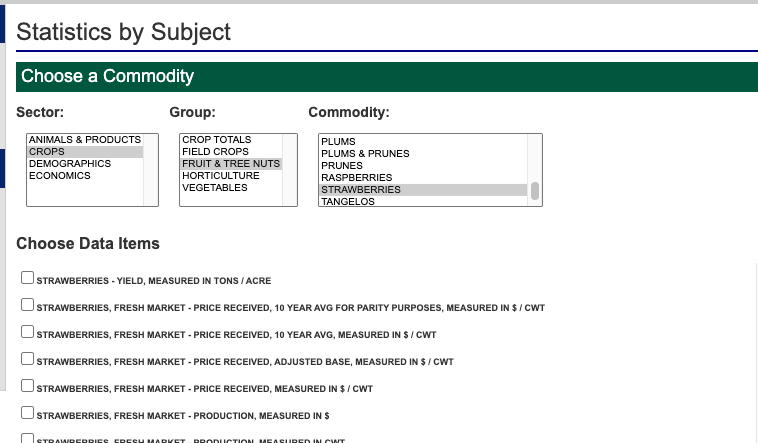

*edit 2/20/2025* This project has been moved to OSF. The most up-to-date data and details can be found at [https://osf.io/rm65a/](https://osf.io/rm65a/).

*Archived project notes below*

## Crops
`strawberries_county_2022.geojson`
- Massachusetts Agricultural Census 2022
- [codebook](https://www.nass.usda.gov/Publications/AgCensus/2022/Full_Report/Volume_1,_Chapter_2_County_Level/Massachusetts/maintro.pdf)
- [ma counties](https://www.nass.usda.gov/Publications/AgCensus/2022/Full_Report/Volume_1,_Chapter_2_County_Level/Massachusetts/st25_2_033_033.pdf)
Accessed 2/10/2025

- [braiding sweetgrass excerpt](https://indigenous.abbyschools.ca/sites/default/files/3.%20%20The%20Gift%20of%20Strawberries%20Excerpt_0_0.pdf)

- USDA export tool for GIS data

## Wild strawberries
`inaturalist_wild_strawberry_observations.geojson`
- Accessed 2/10/2025
- Filtered to MA only
- [GBIF.org](https://www.gbif.org/species/3029779)
- [Wild strawberry Felt map](https://www.gbif.org/species/3029779)